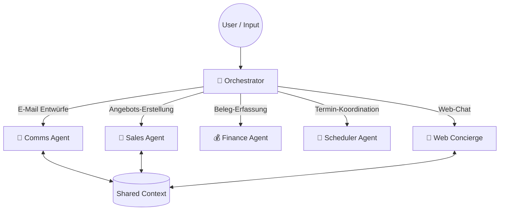

# 🤖 Enterprise Multi-Agent Orchestrator (EMAO)
### Showcase für das Event "KI Konkret" @ Campus Schwarzwald


## 💡 Über dieses Projekt

Dieses Repository enthält den **Live-Democase**, der im Rahmen des Events **"KI Konkret"** am Campus Schwarzwald vorgestellt wird. 

Es demonstriert, wie moderne **Multi-Agenten-Systeme (MAS)** komplexe Unternehmensprozesse automatisieren können, indem sie Aufgaben intelligent verteilen, anstatt sie monolithisch zu bearbeiten. Der Fokus liegt auf der praktischen Anwendbarkeit von KI im Mittelstand.

**Kernfrage der Demo:** *Wie kann ein einziges System E-Mails, Buchhaltungsbelege, Sprachnotizen und Kundenchats gleichzeitig managen?*

---

## 🏗 Architektur der Demo

Das System nutzt eine **Hub-and-Spoke-Architektur**. Ein zentraler "Router" (Orchestrator) analysiert den Input und aktiviert den passenden Experten-Agenten.




## 🧩 Die Agenten im Einsatz

### 1. 📧 E-Mail Management (Comms Agent)
* **Szenario:** Eine unstrukturierte Kundenanfrage trifft ein.
* **Funktion:** Der Agent erkennt den Intent ("Beschwerde" vs. "Anfrage"), nutzt RAG (Retrieval Augmented Generation) für Kontext und erstellt einen passenden Antwortentwurf.
* **Highlight:** Stilistische Überarbeitung (Polishing) auf Knopfdruck.

### 2. 💼 Angebote & Ausschreibungen (Sales Agent)
* **Szenario:** Ein Vertriebler diktiert Stichpunkte nach einem Kundentermin.
* **Funktion:**
    * **Voice-to-Text:** Transkription via Whisper.
    * **Generierung:** Ein mit **Unsloth** fein-getuntes Modell (LoRA) erstellt aus den Stichpunkten ein formatiertes Angebot im Corporate Design.

### 3. 💰 Rechnungswesen (Finance Agent)
* **Szenario:** Eine PDF-Rechnung geht per Mail ein.
* **Funktion:** Nutzung von Vision-Modellen / OCR zur Extraktion von Rechnungsdaten (Betrag, Kreditor, Datum) und automatische Vorkontierung (JSON-Export für DATEV/ERP).

### 4. 📅 Termin Assistenz (Scheduler Agent)
* **Szenario:** Kunde fragt nach einem Termin.
* **Funktion:** "Tool Calling" erlaubt den Zugriff auf Live-Kalenderdaten (API), um freie Slots zu finden und direkt zu buchen.

### 5. 💬 Chatbot (Web Concierge)
* **Szenario:** Frage auf der Website.
* **Funktion:** First-Level-Support basierend auf einer strikten Knowledge-Base, um Halluzinationen zu vermeiden.

---

## 🛠 Tech Stack des Showcases

| Komponente | Technologie | Nutzung im Case |
| :--- | :--- | :--- |
| **Orchestration** | **LangGraph** | Steuerung des Workflows und State-Management zwischen Agenten. |
| **LLM (Reasoning)** | GPT-4o / Claude 3.5 | Routing-Entscheidungen und komplexe Datenextraktion. |
| **LLM (Effizienz)** | Llama 3 (via **Unsloth**) | Demonstration von effizientem Fine-Tuning für spezifische Aufgaben (Sales). |
| **Vector DB** | ChromaDB | Gedächtnis für Kundenhistorie und Dokumente. |
| **Frontend** | Streamlit / FastAPI | Visualisierung der Agenten-Entscheidungen für das Publikum. |

---

## 📂 Projektstruktur

```bash
├── agents/              # Die Logik der einzelnen Experten
├── core/                # Der Orchestrator (Router)
├── data/                # Beispieldaten für die Demo (Rechnungen, Audiofiles)
├── notebooks/           # Jupyter Notebooks für Live-Code-Demos
├── tools/               # Externe Werkzeuge (OCR, Kalender API)
└── main.py              # Startpunkt der Applikation
```
